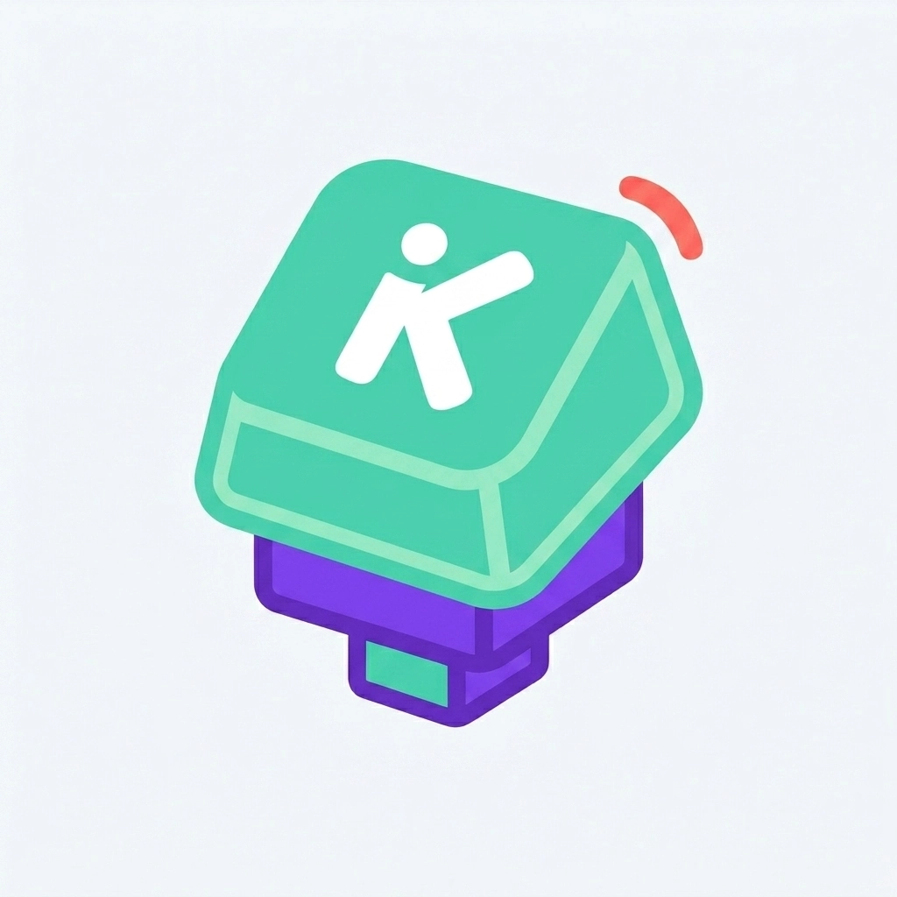

<div align="center">



# ⌨️ Keycoach

### Build your touch-typing instincts. Type faster without looking.

**Train your instincts with structured lesson stages, spaced-repetition reviews, and 3-star objectives.**


</div>

---

## 🎮 What is Keycoach?

Keycoach is a touch-typing coach that teaches your **fingers** instead of your eyes. Progress through
13 arcade-style stages from left-hand fundamentals to full-keyboard mastery, while a spaced-repetition
engine keeps drilling the keys you actually miss — not the ones you already know.

## ✨ Features

- **Structured curriculum** — 13 progressive stages covering left hand, right hand, and full keyboard mastery.
- **Smart SRS review** — a spaced-repetition engine schedules due keys automatically, so you practice what you miss.
- **3-star objectives** — hit 95% accuracy and target speed to earn stars per stage.
- **Multi-language UI** — English, Bahasa Indonesia, Español, Deutsch, Русский (progress is stored per language).
- **Local-first storage** — progress lives in IndexedDB, fully offline; optional Supabase sync when configured.
- **Arcade design system** — playful, keycap-styled UI (see [`docs/design.md`](docs/design.md)), accessible with `prefers-reduced-motion` honored, responsive across devices.

## 🛠️ Stack

| Layer         | Choice                                                         |
| ------------- | -------------------------------------------------------------- |
| Framework     | SvelteKit 5 (runes) + Vite, `ssr=false` SPA                    |
| Styling       | Tailwind CSS 4 (`@tailwindcss/vite`)                           |
| UI primitives | shadcn-svelte (bits-ui)                                        |
| Storage       | `idb` for IndexedDB, `@supabase/supabase-js` for optional sync |
| Testing       | Vitest unit tests                                              |

## 🚀 Getting started

```sh
# install dependencies
npm install

# start the dev server
npm run dev
```

## 🔑 Environment

Copy `.env.example` to `.env` and fill in the Supabase credentials. The app runs **fully offline**
without them — sync is only enabled when both are set.

```
VITE_SUPABASE_URL=https://your-project-id.supabase.co
VITE_SUPABASE_ANON_KEY=your-anon-key-here
```

## 📜 Scripts

| Command           | Description                       |
| ----------------- | --------------------------------- |
| `npm run dev`     | Start the dev server              |
| `npm run build`   | Production build (adapter-vercel) |
| `npm run preview` | Preview the production build      |
| `npm run check`   | Type-check with svelte-check      |
| `npm run test`    | Run vitest unit tests             |

## 🗂️ Project structure

```
src/
├── routes/            # /, /lessons/[id], /review, /settings, sitemap.xml
├── lib/
│   ├── components/    # UI primitives (shadcn) + app components
│   ├── stores/        # runes-based stores (progress, srs, i18n)
│   ├── srs/           # spaced-repetition engine
│   ├── curriculum.ts  # lesson stage definitions
│   ├── generate.ts    # word generation for drills
│   └── db.ts          # IndexedDB layer
static/                # logo.webp, og.webp, robots.txt
docs/
└── design.md          # the arcade design system
```

## 🔍 SEO

- Per-route titles, descriptions, canonical/OG/Twitter tags and JSON-LD structured data — emitted in `src/routes/+layout.svelte` from `page.url.origin`.
- `sitemap.xml` generated dynamically at `/sitemap.xml`.
- `robots.txt` references the sitemap.

## 🖼️ Open Graph

`static/og.webp` (1376×768) powers the social share card.

<div align="center">


</div>

---

<div align="center">

Made with ☕ and a lime accent. Type fast, look nowhere. ⌨️

</div>
